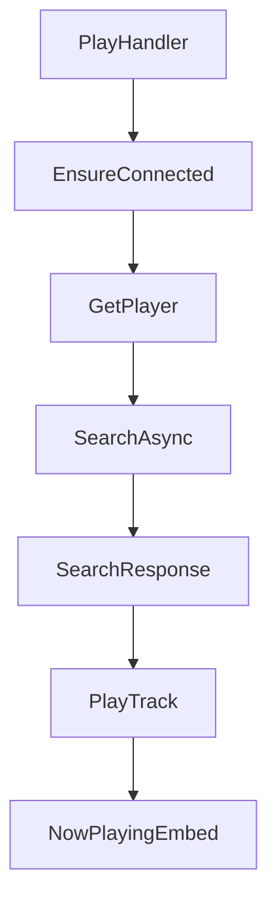

| Name | Description |
|--|--|
| PlayHandler | Holds the logic for playing songs |
| GetPlayer | Joins voice channel, produces chat resposne |
| EnsureConnected | Makes sure the client is connected |
| SearchAsync | Searches for songs information |
| SearchResponse | Handling possible errors from the response of SearchAsync |
| PlayTrack | Plays the song |

There is also OnTrackEnd, when it get called an attempt is made to play the next song in queue.

Short explaination for some of the variables used:

| Variable | Type | Description |
| --- | --- | --- |
| `_lavaNode` | `LavaNode` | An instance of the `LavaNode` class, used to interact with the LavaLink server for playing music in Discord voice channels. |
| `_client` | `DiscordSocketClient` | An instance of the `DiscordSocketClient` class, used to interact with the Discord API for sending messages, joining voice channels, etc. |
| `_musicEmbed` | `MusicEmbed` | An instance of a custom `MusicEmbed` class, used to create and send embed messages related to the music player's current status. |
| `context` | `SocketSlashCommand` | An instance of the `SocketSlashCommand` class, representing a slash command received from Discord. Used to get information about the command and to respond to it. |
| `player` | `LavaPlayer` | An instance of the `LavaPlayer` class, representing a music player connected to a specific voice channel. Used to play, pause, skip, and queue tracks. |
| `guildMessageIds` | `Dictionary<ulong, List<ulong>>` | A dictionary that maps guild IDs to lists of message IDs. Used to keep track of messages sent by the bot in each guild, allowing the bot to delete its old messages when it sends new ones. |
| `songName` | `string` | A string that represents the name or URL of a song to play. Used to search for and queue tracks. |
| `searchResponse` | `SearchResponse` | An instance of the `SearchResponse` class, representing the result of a search for tracks. Used to get the tracks that were found and queue them in the player. |
