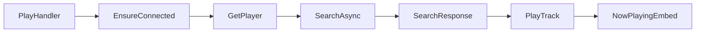

| Name | Description |
|--|--|
| PlayHandler | Holds the logic for playing songs |
| GetPlayer | Joins voice channel, produces chat resposne |
| EnsureConnected | Makes sure the client is connected |
| SearchAsync | Searches for songs information |
| SearchResponse | Handling possible errors from the response of SearchAsync |
| PlayTrack | Plays the song |

There is also OnTrackEnd, when it get called an attempt is made to play the next song in queue.
