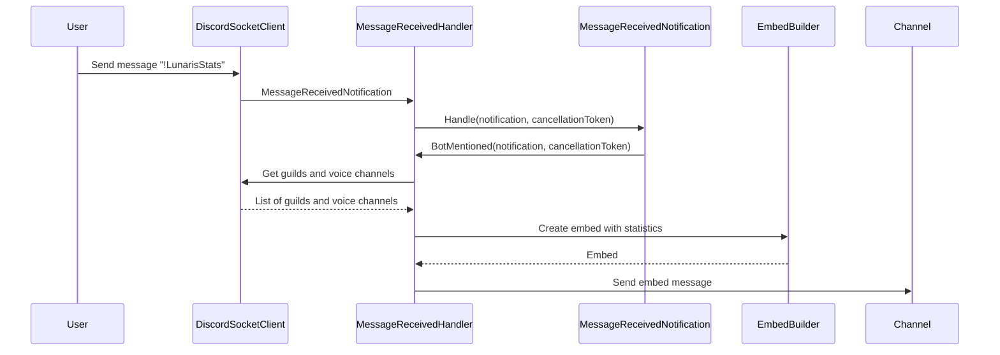
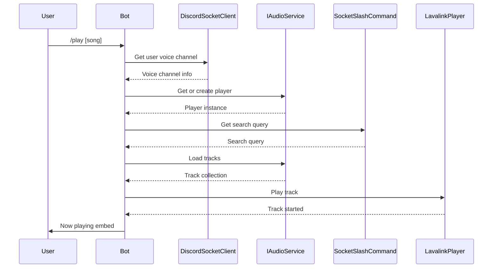
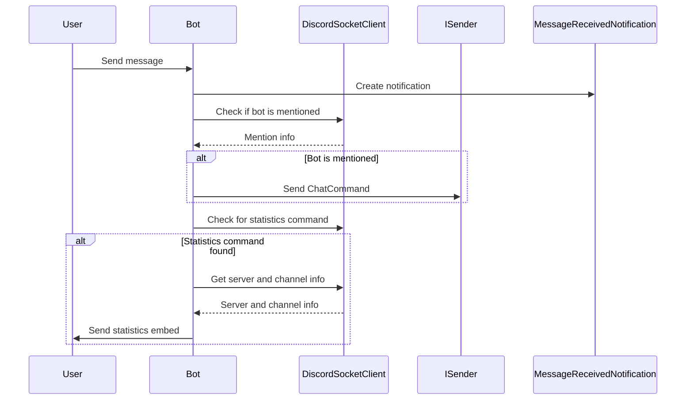

### README.md

# Handlers

Handlers for the Lunaris2 bot, which is built using C#, Discord.Net, and Lavalink4NET. Below is a detailed description of each handler and their responsibilities.

## Handlers

### ClearQueueHandler

Handles the command to clear the music queue.

```csharp
public class ClearQueueHandler : IRequestHandler<ClearQueueCommand>
```

### DisconnectHandler

Handles the command to disconnect the bot from the voice channel.

```csharp
public class DisconnectHandler : IRequestHandler<DisconnectCommand>
```

### PauseHandler

Handles the command to pause the currently playing track.

```csharp
public class PauseHandler : IRequestHandler<PauseCommand>
```

### PlayHandler

Handles the command to play a track or playlist.

```csharp
public class PlayHandler : IRequestHandler<PlayCommand>
```

### ResumeHandler

Handles the command to resume the currently paused track.

```csharp
public class ResumeHandler : IRequestHandler<ResumeCommand>
```

### SkipHandler

Handles the command to skip the currently playing track.

```csharp
public class SkipHandler : IRequestHandler<SkipCommand>
```

### MessageReceivedHandler

Handles incoming messages and processes commands or statistics requests.

```csharp
public class MessageReceivedHandler : INotificationHandler<MessageReceivedNotification>
```

## Mermaid Diagrams

### Class Diagram



### Sequence Diagram for PlayHandler



### Sequence Diagram for MessageReceivedHandler



This README provides an overview of the handlers and their responsibilities, along with class and sequence diagrams to illustrate the interactions and relationships between the components.
