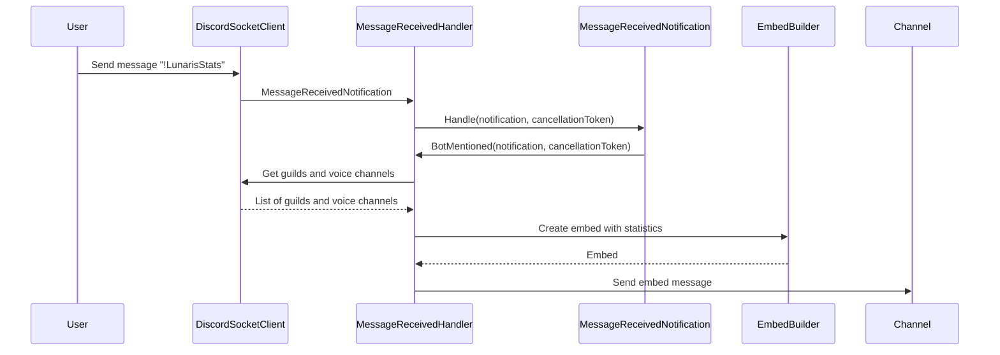
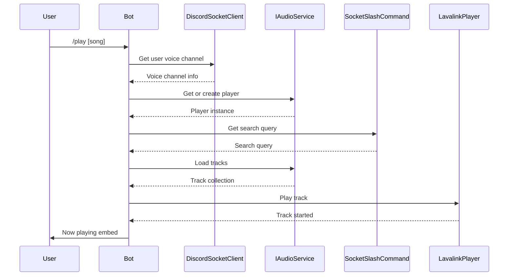
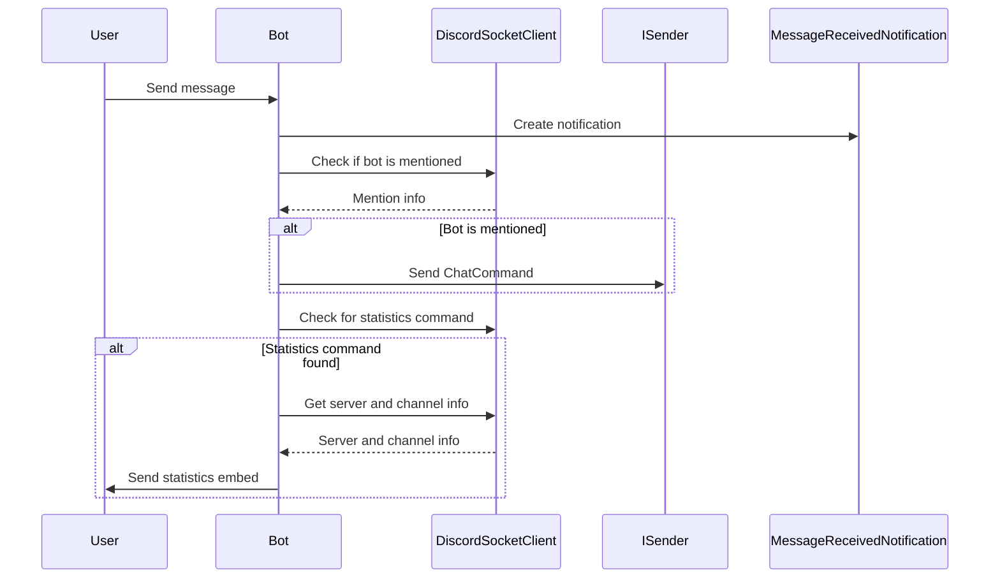

### README.md

# Handlers

Handlers for the Lunaris2 bot, which is built using C#, Discord.Net, and Lavalink4NET. Below is a detailed description of each handler and their responsibilities.

## Handlers

### ClearQueueHandler

Handles the command to clear the music queue.

```csharp
public class ClearQueueHandler : IRequestHandler<ClearQueueCommand>
```

### DisconnectHandler

Handles the command to disconnect the bot from the voice channel.

```csharp
public class DisconnectHandler : IRequestHandler<DisconnectCommand>
```

### PauseHandler

Handles the command to pause the currently playing track.

```csharp
public class PauseHandler : IRequestHandler<PauseCommand>
```

### PlayHandler

Handles the command to play a track or playlist.

```csharp
public class PlayHandler : IRequestHandler<PlayCommand>
```

### ResumeHandler

Handles the command to resume the currently paused track.

```csharp
public class ResumeHandler : IRequestHandler<ResumeCommand>
```

### SkipHandler

Handles the command to skip the currently playing track.

```csharp
public class SkipHandler : IRequestHandler<SkipCommand>
```

### MessageReceivedHandler

Handles incoming messages and processes commands or statistics requests.

```csharp
public class MessageReceivedHandler : INotificationHandler<MessageReceivedNotification>
```

## Mermaid Diagrams

### Class Diagram



### Sequence Diagram for PlayHandler



### Sequence Diagram for MessageReceivedHandler



## Extensions.cs

#### Namespaces
- **Discord**: Provides classes for interacting with Discord.
- **Discord.WebSocket**: Provides WebSocket-specific classes for Discord.
- **Lavalink4NET**: Provides classes for interacting with Lavalink.
- **Lavalink4NET.Players**: Provides player-related classes for Lavalink.
- **Lavalink4NET.Players.Queued**: Provides queued player-related classes for Lavalink.
- **Microsoft.Extensions.Options**: Provides classes for handling options and configurations.

#### Class: `Extensions`
This static class contains extension methods for various Discord and Lavalink operations.

##### Method: `GetPlayerAsync`
- **Parameters**:
  - `IAudioService audioService`: The audio service to retrieve the player from.
  - `DiscordSocketClient client`: The Discord client.
  - `SocketSlashCommand context`: The context of the slash command.
  - `bool connectToVoiceChannel`: Whether to connect to the voice channel (default is true).
- **Returns**: `ValueTask<QueuedLavalinkPlayer?>`
- **Description**: Retrieves a `QueuedLavalinkPlayer` for the given context. If the retrieval fails, it returns null and sends an appropriate error message.

##### Method: `GetGuild`
- **Parameters**:
  - `SocketSlashCommand message`: The slash command message.
  - `DiscordSocketClient client`: The Discord client.
- **Returns**: `SocketGuild`
- **Description**: Retrieves the guild associated with the given slash command message. Throws an exception if the guild ID is null.

##### Method: `GetVoiceState`
- **Parameters**:
  - `SocketSlashCommand message`: The slash command message.
- **Returns**: `IVoiceState`
- **Description**: Retrieves the voice state of the user who issued the slash command. Throws an exception if the user is not connected to a voice channel.

##### Method: `RespondAsync`
- **Parameters**:
  - `SocketSlashCommand message`: The slash command message.
  - `string content`: The content of the response.
- **Returns**: `Task`
- **Description**: Sends an ephemeral response to the slash command.

##### Method: `GetOptionValueByName`
- **Parameters**:
  - `SocketSlashCommand command`: The slash command.
  - `string optionName`: The name of the option to retrieve the value for.
- **Returns**: `string`
- **Description**: Retrieves the value of the specified option from the slash command. Returns an empty string if the option is not found.
  
