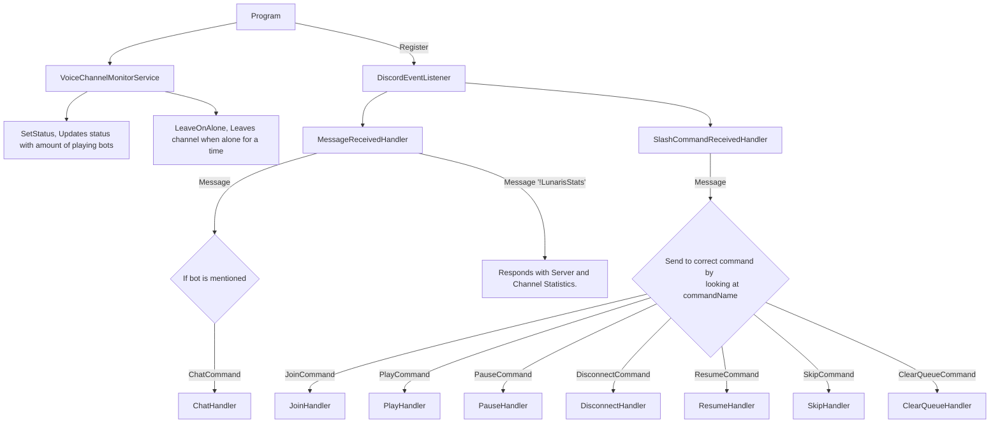
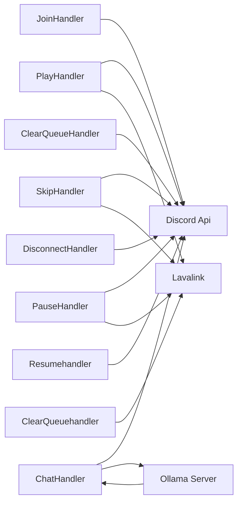

## How commands from Discord gets executed

Program registers an event listener ```DiscordEventListener``` which publish a message :

```c#
await Mediator.Publish(new MessageReceivedNotification(arg), _cancellationToken);
```

|Name| Description |
|--|--|
| SlashCommandReceivedHandler | Handles commands using ``/`` from any Discord Guild/Server. |
| MessageReceivedHandler| Listens to **all** messages. |

## Handler integrations

|Name| Description |
|--|--|
| JoinHandler| Handles the logic for **just** joining a voice channel. |
| PlayHandler| Handles the logic for joining and playing music in a voice channel. |
| PauseHandler | Handles the logic for pausing currently playing track. |
| DisconnectHandler | Handles the logic for disconnecting from voicechannels. |
| ClearQueueHandler | Handles the logic for clearing the queued songs, except the currently playing one. |
| SkipHandler | Handles the logic for skipping tracks that are queued. If 0 trackS is in queue, it stops the current one.|
| Resumehandler | Resumes paused tracks. |
| ChatHandler| Handles the logic for LLM chat with user. |


