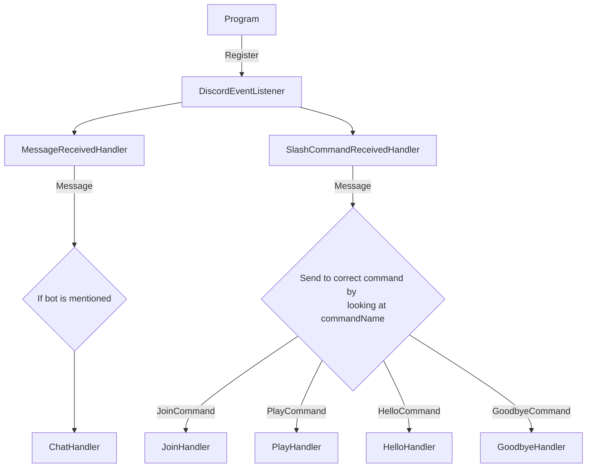
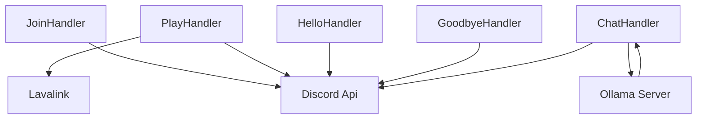

## How commands from Discord gets executed

Program registers an event listener ```DiscordEventListener``` which publish a message :

```c#
await Mediator.Publish(new MessageReceivedNotification(arg), _cancellationToken);
```

## Handler integrations

